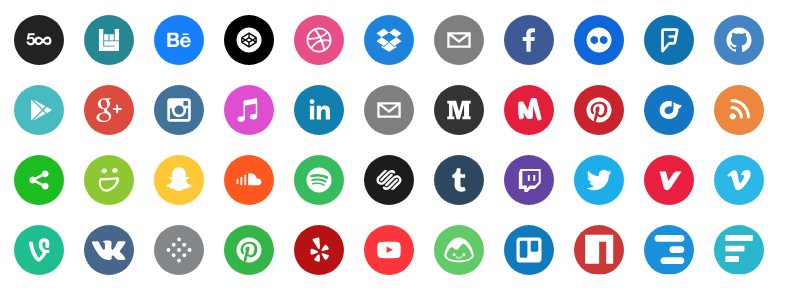

# react-network-icons

is the a forked version of 'react-social-icons' by Jake Trent, with the addition of company/networking icons 

# react-social-icons

A set of beautiful svg social icons.  Easily used in React.  No images or external css dependencies.  Svg paths provided by Squarespace and homemade.



## Install

```
npm install react-network-icons --save-dev

or 

yarn add react-network-icons
```

## Usage

Pass in the `url` prop of your social network, and the icon will be rendered.

```js

import { NetworkIcon } from 'react-network-icons';


<NetworkIcon url="http://bascamp.com/janedoe" />;

```

<!-- See more [usage options on the example site](http://jaketrent.github.io/react-social-icons/). -->
<!-- 
## Rebuild Examples

```
git checkout gh-pages
git rebase master
sh scripts/gen-gh-pages.sh
``` -->
